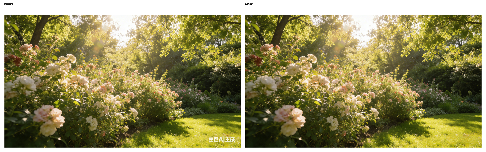

[English](./README_EN.md) | [中文](./README.md)

# remove_watermark

An AI-based watermark removal tool built on the open-source LaMa inpainting model. The old OpenCV heuristic pipeline has been removed; the repository now contains only the AIGC workflow.

The current flow is split into two steps:

- locate the region to remove with a manual mask, ROI, or OCR
- run LaMa to inpaint the target area locally

This approach is more reliable on grass, walls, fabrics, repeated textures, and soft gradients where traditional repair tends to leave visible artifacts. It is also better suited for batch removal of the same text watermark.

## Before/After

`avatar1`:


`garden`:



## Features

- CLI for single-image cleanup
- batch directory processing
- remove watermarks by target text via OCR
- export OCR box previews for batch verification
- local web UI with brush-based masking
- manual mask, ROI, and OCR text matching can be combined

## Dependencies

- Python `3.11` recommended
- `simple-lama-inpainting` currently requires `Pillow<10`
- GPU is recommended, but CPU also works; first inference will be slower

Install:

```bash
python3 -m venv .venv
source .venv/bin/activate
python -m pip install -U pip
python -m pip install -r requirements.txt
```

If you already use a local conda environment, you can run the project with that interpreter instead.

## Project Layout

```text
remove_watermark/
├── app.py
├── cli.py
├── inpaint_core.py
├── requirements.txt
├── README.md
├── README_EN.md
└── assets/
    ├── avatar1_compare.png
    ├── avatar1.png
    ├── garden_compare.png
    └── garden.png
```

## CLI

1. Use an external mask image:

```bash
python cli.py \
  -i ./assets/avatar1.png \
  -o ./outputs/avatar1_clean.png \
  --mask ./your_mask.png \
  --mask-output ./outputs/avatar1_mask.png
```

2. Use an ROI:

```bash
python cli.py \
  -i ./assets/garden.png \
  -o ./outputs/garden_clean.png \
  --roi 2350,1300,320,130 \
  --mask-output ./outputs/garden_mask.png
```

3. Remove a watermark by text only:

```bash
python cli.py \
  -i ./assets/avatar1.png \
  -o ./outputs/avatar1_clean.png \
  --target-text "豆包AI生成" \
  --ocr-preview ./outputs/avatar1_ocr_preview.png \
  --mask-output ./outputs/avatar1_mask.png
```

4. Batch process a directory:

```bash
python cli.py \
  -i ./batch_inputs \
  -o ./batch_outputs \
  --target-text "豆包AI生成" \
  --ocr-preview ./batch_ocr_preview \
  --mask-output ./batch_masks
```

Notes:

- in directory mode, `--mask-output` becomes a mask output directory
- in directory mode, `--ocr-preview` becomes an OCR preview output directory
- directory mode supports `png/jpg/jpeg/webp/bmp`
- directory mode does not support a single `--mask` file
- if one file does not match the target text, the CLI prints `[WARN]` and continues

## Common Options

- `--mask`: external mask image; white regions are removed
- `--roi`: rectangle in `x,y,w,h`
- `--target-text`: watermark text to remove; OCR finds boxes first
- `--text-match-mode`: `contains` or `exact`
- `--ocr-min-score`: minimum OCR confidence, default `0.5`
- `--ocr-box-padding`: extra padding outside matched OCR text boxes, useful for outer glow / gray halos
- `--flat-bg-mode`: flat background mode for local color smoothing near the repaired area
- `--flat-bg-blur`: smoothing radius for flat background mode, default `24`
- `--flat-bg-strength`: smoothing strength for flat background mode, default `0.8`
- `--ocr-preview`: export OCR box preview images; matched boxes are red, other OCR boxes are blue
- `--mask-output`: save the final mask sent into LaMa
- `--expand`: expand mask edges, default `12`
- `--feather`: relax mask boundaries slightly, default `6`
- `--mask-threshold`: mask binarization threshold, default `32`
- `--invert-mask`: invert black/white semantics for external masks

## Web UI

Start:

```bash
python app.py
```

In the browser you can:

- upload an image
- enter target watermark text for OCR-based matching
- paint white mask strokes directly on the image
- add ROI values
- enable flat background mode to suppress faint gray halos further
- preview the final mask before running AI inpainting

## Tuning Tips

If the background is flat or nearly flat and you still see a gray halo after the text is removed, the usual cause is not LaMa itself. The more common issue is that the watermark's semi-transparent glow or shadow is outside the mask.

Tune in this order:

- increase `--ocr-box-padding` first
- then increase `--expand`
- if needed, enable `--flat-bg-mode`
- then fine-tune `--flat-bg-blur` and `--flat-bg-strength`

For watermarks like `豆包AI生成` with white text plus a soft gray glow, start with:

```bash
python cli.py \
  -i ./assets/avatar1.png \
  -o ./outputs/avatar1_clean.png \
  --target-text "豆包AI生成" \
  --ocr-box-padding 16 \
  --expand 14 \
  --feather 4 \
  --flat-bg-mode \
  --flat-bg-blur 24 \
  --flat-bg-strength 0.8
```

## Sample Assets

- [avatar1.png](./assets/avatar1.png)
- [garden.png](./assets/garden.png)

## Fit / Limits

Works better for:

- corner logos or corner text
- light or semi-transparent text watermarks
- local removals on textured backgrounds
- batch removal of the same watermark text

Still not ideal for:

- heavy full-image watermark overlays
- cases where key subjects are completely blocked
- legal or forensic scenarios that require faithful reconstruction of real details

## Compliance

- only process images you own, are authorized to use, or are explicitly allowed to edit
- make sure your use complies with the source platform terms and applicable laws
