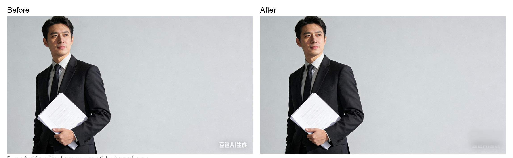

[中文](./README.md) | [English](./README_EN.md)

# Corner Overlay Cleanup Tool

This tool is intended for cleaning up corner text, logos, or other overlays in images you own or are authorized to edit.
It works best on solid-color, gradient, or near-smooth background areas.



## Features

- `mode=1`: best for corner text or logo overlays
- `mode=2`: best for repeated light overlays or textures across the image

## Install

```bash
python3 -m pip install -r requirements.txt
```

## Usage

```bash
python3 remove_watermark.py -i input.jpg -o output.jpg -m 1
```

```bash
python3 remove_watermark.py -i input.jpg -o output.jpg -m 2
```

## Optional Arguments

- `--mask-output`: export the detected mask for inspection
- `--corner-ratio`: only for `mode=1`, controls the corner detection area, default `0.24`
- `--strength`: detection aggressiveness, default `1.0`
- `--corner`: only for `mode=1`, choose from `all/top-left/top-right/bottom-left/bottom-right`
- `--roi`: only for `mode=1`, manually specify a target region as `x,y,w,h`; takes priority over `--corner`

## Project Structure

```text
remove_print/
├── assets/
│   └── before_after_case3.png
├── remove_watermark.py
├── requirements.txt
├── README.md
└── README_EN.md
```

- `remove_watermark.py`: CLI entrypoint and main processing logic
- `assets/`: sample images used by the README
- `requirements.txt`: runtime dependencies
- `README.md` / `README_EN.md`: Chinese and English documentation

## Examples

Corner overlay cleanup:

```bash
python3 remove_watermark.py \
  -i ./people.png \
  -o ./people_clean.png \
  -m 1 \
  --corner bottom-right \
  --roi 2350,1300,320,130 \
  --mask-output ./people_mask.png
```

Repeated overlay cleanup:

```bash
python3 remove_watermark.py \
  -i ./examples/in.jpg \
  -o ./examples/out.jpg \
  -m 2 \
  --strength 1.2
```

## Notes

- `mode=1` focuses on light text, logos, or similar overlays near image corners.
- `mode=2` searches the full image for repeated light overlays or textures.
- If auto-detection is unstable, provide `--roi x,y,w,h` to constrain the target area.
- Use `--mask-output` first when tuning parameters, then adjust `--strength`.
- The current workflow is best suited to solid-color, gradient, or near-smooth background areas; results on highly textured backgrounds may be less stable.

## Compliance

- Only use this tool on images you own, control, or are authorized to modify.
- Make sure your use complies with platform rules, service terms, and applicable law.
